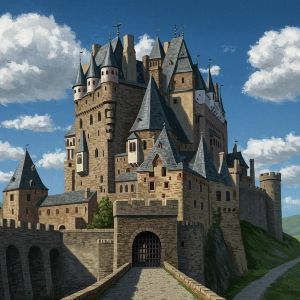

You aim for the bushes below you only to realize...

There is only one tree in the courtyard and you completely missed it.

You die upon impact with the ground and the thief gets away with the princess.

Your men were never alerted, therefore no one was able to see the princess being taken or where.

:skull::skull::skull:

[Try again?](KnightStart.md)

[Main Menu](../_main-menu.md)