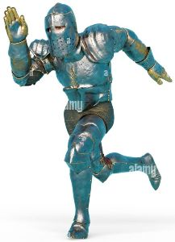

:running: You make a mad dash for the front gate to cut off the thief.  You spot him coming around the corner of the castle.  You shout for your men to join in the chase as well.  Being the most experienced, you take the lead and start gaining on the thief.

As you are making progress towards the thief, you look back to see your men falling to various traps laid by the thief for his escape.

:mag_right::mag: [Slow down and check for more traps.](./KnightScene2A.md)

:dash: [Continue full sprint towards the thief.]

:ambulance: [Go back and help your men.]