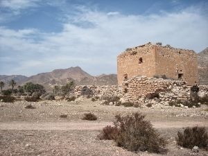

You stop your chase and turn around to help your men get free from their traps.  You did watch the thief to see where he was going.  He seems to have hid in a nearby building, you make note of it and return to your men.

You make it back to your men and start helping them get free.

After everyone is free, you notice that they're all injured and can't continue with you.  You tell them to retreat to the castle while you checkout the hideout you had seen the thief retreat to.

[Continue](./KnightScene3.md)