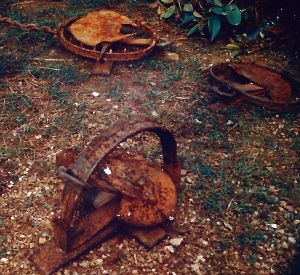
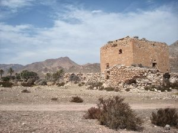

You stop to take some time to lay some traps.

After setting the traps.  You quickly then make your departure towards this building beyond the castle.

With plenty of time, you head inside and meet the wizard and a fighter and you sit at the table with them and the princess.

:arrow_forward:[Continue](./ThiefScene5.md)