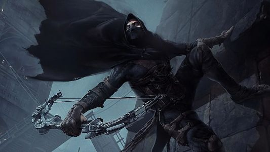

Shortly after you settle down, you hear a knock at the door.  The fighter answers and lets the knight inside.  The wizard says to the knight, "Welcome, we've been expecting you.  Please, have a seat."

"We would like you to join our guild, Sir Knight."  The wizard continues to speak to the knight.  "We had the thief capture the princess to bring you here.  She is also part of the guild and this was her idea to get you involved.  It was a test of your skill and your resourcefulness.  We would like you to bring that determination and tenacity to our team."

The knight looks at you and the princess.  It's then that the princess smiles and nods.  Acknowledging that she was the one that sent the original message with the crow.

You sit back and enjoy a job well done as the guild tries to continue to recruit the determined knight.

:tada:Congratulations.  You have completed the Thief's path.

THE END!!!

:leftwards_arrow_with_hook: [Try again as the Thief?](./ThiefStart.md)

:rewind: [Main Menu](../_main-menu.md)